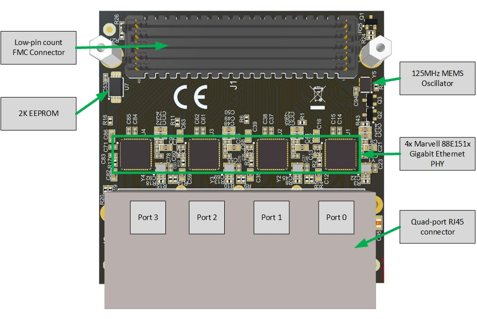
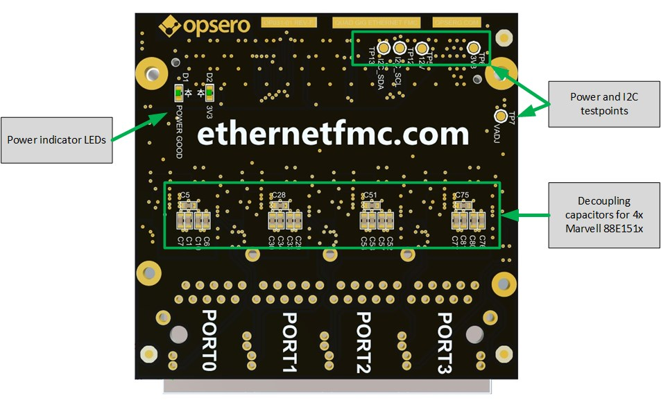
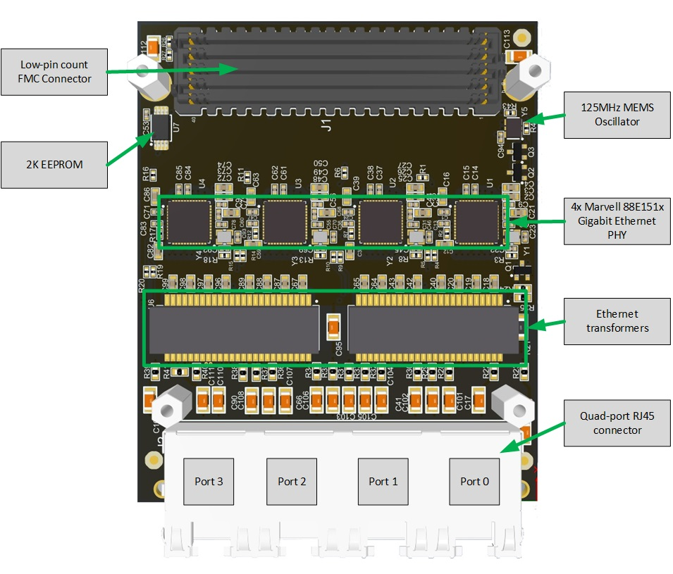
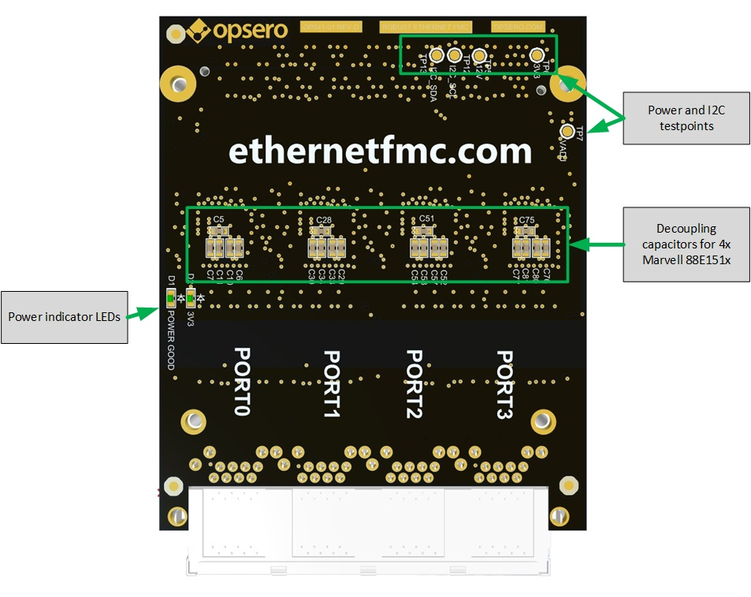
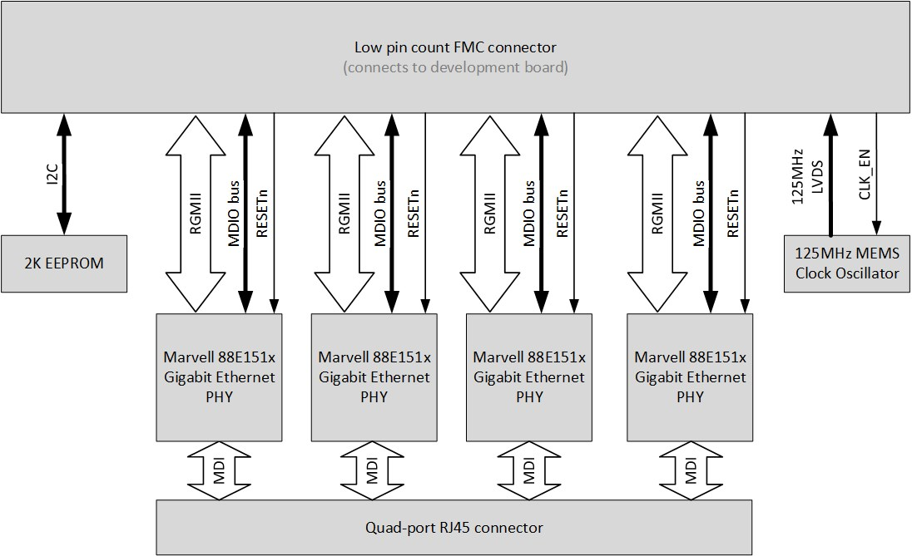
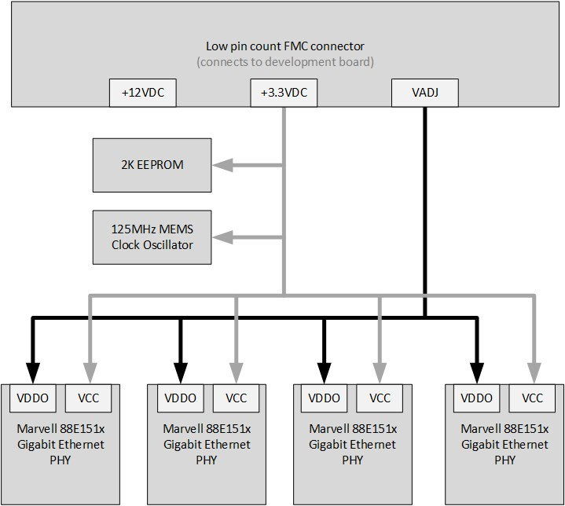
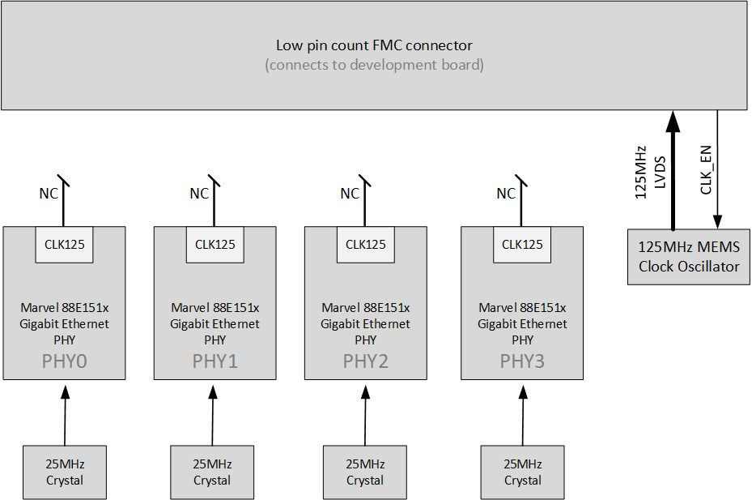
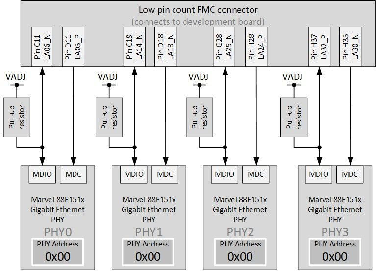

====================
Detailed Description
====================

Hardware Overview
=================

Ethernet FMC
------------

The figure below illustrates the various hardware components that are located
on the top-side of the Ethernet FMC.

    
    Ethernet FMC labelled top-side
    
The main components on the top-side of the mezzanine card are:

* 4x Marvell 88E151x Gigabit Ethernet PHYs
* Low Pin Count FMC Connector
* 2K EEPROM
* 125MHz MEMS Clock Oscillator
* 4x 25MHz crystals
* Quad-port RJ45 connector

The figure below illustrates the various hardware components that are located on
the bottom-side of the mezzanine card.

    
    Ethernet FMC labelled bottom-side

The main components on the bottom-side of the mezzanine card are:

* Decoupling capacitors for the Marvell 88E151x Ethernet PHYs
* Power indicator LEDs
* Test points for power and I2C

Robust Ethernet FMC
-------------------

The figure below illustrates the various hardware components that are located
on the top-side of the Robust Ethernet FMC.

    
    Robust Ethernet FMC labelled top-side
    
The main components on the top-side of the mezzanine card are:

* 4x Marvell 88E151x Gigabit Ethernet PHYs
* Low Pin Count FMC Connector
* 2K EEPROM
* 125MHz MEMS Clock Oscillator
* 4x 25MHz crystals
* Ethernet transformers
* Quad-port RJ45 connector

The figure below illustrates the various hardware components that are located on
the bottom-side of the mezzanine card.

    
    Robust Ethernet FMC labelled bottom-side

The main components on the bottom-side of the mezzanine card are:

* Decoupling capacitors for the Marvell 88E151x Ethernet PHYs
* Power indicator LEDs
* Test points for power and I2C

Marvell 88E151x Gigabit Ethernet PHY
====================================

There are 4x Marvell 88E151x Gigabit Ethernet PHYs on the mezzanine card, one for each
of the four Gigabit Ethernet ports. For interfacing with a MAC, the 88E151x has 
an RGMII (Reduced pin count GMII) interface. The 88E151x is designed for low-power and
supports Synchronous Ethernet (SyncE) and Precise Timing Protocol (PTP) Time Stamping. 
For more specific information on the 88E151x, please refer to the 
`datasheet <https://www.marvell.com/content/dam/marvell/en/public-collateral/transceivers/marvell-phys-transceivers-alaska-88e151x-datasheet-2018-02.pdf>`_.

In this documentation, we will refer to the PHYs as PHY0, PHY1, PHY2 and PHY3, 
corresponding to their placement from right-to-left and as shown in 
:numref:`ethernet-fmc-top-labelled`.

RJ45 Connector
==============

The table below lists the RJ45 connectors and Ethernet magnetics used on the Ethernet FMC 
and Robust Ethernet FMC.

+-----------------------------+-----------------------+-------------------+
|                             | RJ45 P/N              | Magnetics P/N     |
+=============================+=======================+===================+
| Ethernet FMC                | JG0-0025NL            | Integrated        |
|                             +-----------------------+-------------------+
|                             | LPJG48851AFNL         | Integrated        |
+-----------------------------+-----------------------+-------------------+
| Robust Ethernet FMC         | RJE72-488-1451        | HX5020FNL         |
+-----------------------------+-----------------------+-------------------+

The differences between the Ethernet FMC and Robust Ethernet FMC all stem from the
choice of RJ45 connector. The Ethernet FMC uses an RJ45 connector with integrated
magnetics, whereas the Robust Ethernet FMC uses one without magnetics. Consequently,
the Robust Ethernet FMC uses discrete Ethernet transformers that are separate from
the RJ45 connector. The Robust Ethernet FMC was designed in this way to allow it's
physical height profile to fit within that specified by the VITA 57.1 standard. For
more information, see :ref:`mec-info`.

EEPROM
======

The 2K EEPROM stores IPMI FRU data that can be read by the carrier board and contains
the following information:

* Manufacturer name (Opsero Electronic Design Inc.)
* Product name
* Product part number
* Serial number
* Power supply requirements

The FRU data is read by some carrier boards to determine the correct VADJ
voltage to apply to the mezzanine card. All Opsero FMC products have their EEPROMs
programmed with valid FRU data to allow these carrier boards to correctly power them.

.. WARNING:: Erasing or writing over the contents of the EEPROM can corrupt the IPMI FRU
          data making the mezzanine card unusable with carrier boards that require the
          information. We recommend that you do not use the mezzanine card's EEPROM for 
          non-volatile storage but instead use the storage options provided by the 
          carrier board. If you mistakenly erase or corrupt the contents of the EEPROM, 
          you can reprogram it using the Opsero FMC EEPROM Tool. Read more about the 
          :ref:`eeprom-tool` in the User Guide.

Low Pin Count FMC Connector
===========================

The Ethernet FMC has a low pin count FMC (FPGA Mezzanine Card) connector for interfacing
with an FPGA or SoC development board. The part number of this connector is 
`ASP-134604-01 <http://suddendocs.samtec.com/prints/asp-134604-01.pdf>`_. 
The pinout of this connector conforms to the VITA 57.1 FPGA Mezzanine Card Standard (for 
more information, see :ref:`pinout`). For more information on the FMC connector and the 
VITA 57.1 standard, see the `Samtec page <https://www.samtec.com/standards/vita/fmc>`_.

I/O Interfaces
==============

The FMC connector provides power to the Ethernet FMC and also presents the following I/O 
signals to the FPGA fabric of the development board:

* RGMII for each of the 4x PHYs
* MDIO for each of the 4x PHYs
* I2C for EEPROM R/W access
* Clock enable for 125MHz oscillator
* 125MHz LVDS clock

The figure below illustrates the connections to the FMC connector.

    
    FMC Connector
    
RGMII
-----

The 4x Reduced pin count GMII interfaces form the connection between the Ethernet PHYs and the MACs 
that are implemented in the FPGA or SoC on the development board. The RGMII interface is a DDR (double
data rate) interface that is composed of the following 12 signals:

* Receive data (4 bits)
* Receive clock signal
* Receive control signal
* Transmit data (4 bits)
* Transmit clock signal
* Transmit control signal

MDIO
----

Each of the 4x MDIO interfaces consist of two signals:

* MDIO Clock signal (driven by the FPGA)
* MDIO Data signal (bidirectional)

The MDIO interface is used to configure the registers of the Ethernet PHYs. More information
regarding the 88E151x registers can be found in the 
`datasheet <https://www.marvell.com/content/dam/marvell/en/public-collateral/transceivers/marvell-phys-transceivers-alaska-88e151x-datasheet-2018-02.pdf>`_.

RESETn
------

Each of the 4x Ethernet PHYs have an active-low reset input that must be driven by the FPGA.

Power Supplies
==============

All power required by the Ethernet FMC is supplied by the development board through the
FMC connector:

* +12VDC
* +3.3VDC
* VADJ: +2.5VDC or +1.8VDC

.. NOTE:: Note that although the FMC standard provides for a 12VDC supply, the Ethernet FMC does not
       use that supply nor does it draw current from that supply.

.. WARNING:: The VADJ voltage applied to the Ethernet FMC must match the version being used.
          To determine the appropriate VADJ voltage for your Ethernet FMC, refer to the
          serial number label - it should contain the numbering "1.8V" or "2.5V" next to the
          serial number.

    
    Power supplies

3.3VDC Supply
-------------

The 3.3VDC supply is the main power supply for the 4x 88E151x Gigabit Ethernet PHYs and it
also powers the EEPROM and 125MHz MEMS oscillator.

VADJ Supply
-----------

The Ethernet FMC is available in two versions: 1.8V and 2.5V, this corresponds to the VADJ
voltage that is required by the board. The difference between the two versions is the part
number of the Marvell Gigabit Ethernet PHY that is soldered onto the board. The 1.8V version
is loaded with the 88E1518, while the 2.5V version is loaded with the 88E1510.

The VADJ supply is used as the I/O power supply of the 4x 88E151x Gigabit Ethernet PHYs, and 
this determines the voltage level that must be used by all I/O to and from the PHYs (RGMII, 
MDIO, RESET_N).

Power LEDs and testpoints
-------------------------

Two LEDs (labelled D1 and D2) on the Ethernet FMC are used to indicate when the required 
power supplies are active. LED D1 indicates the presence of the 3.3VDC supply and connects 
to the 3.3VDC power supply through a current limiting resistor. LED D2 indicates the 
presence of the VADJ power supply and connects to the POWER GOOD signal that is driven by 
the carrier board and is part of the Vita 57.1 FMC standard.

To aid hardware debug, there is a test point for each of the power supplies on the back side 
of the Ethernet FMC.

Clocks
======

The figure below illustrates the clock connections on the Ethernet FMC.

    
    Clocks

Each of the 4x 88E151x PHYs is connected to a 25MHz crystal for generation of it's own internal
clocks. The Ethernet FMC also has a 125MHz MEMS clock oscillator with LVDS output to provide the FPGA
fabric with a precision clock for driving the Ethernet MACs.

Each 88E151x PHY has a CLK125 pin that outputs a 125MHz clock that is synchronized with the 25MHz 
reference clock. Due to the limited number of pins on the LPC FMC connector, the CLK125 pins are left
unconnected on the mezzanine card, hence these clocks are not available to the carrier board.

Resets
======

The 88E151x Ethernet PHYs each have a hardware reset pin (RESETn) that is routed separately to the 
FMC connector (see :numref:`ethernet-fmc-fmc` for details). The reset pin must be driven by the 
development platform with an active-low signal. There are no pull-up resistors
connected to the reset signals on the Ethernet FMC card, and we recommend always driving the 
reset pins from the development platform in order to ensure reliable reset behavior.

PHY Configuration
=================

Configuration of the PHY by software is performed using the MDIO bus. The MDIO bus consists of
two signals: a bidirectional data signal (MDIO) and a clock signal (MDC). The data signal (MDIO)
is driven by the master and slaves as an open drain output, and it is connected to a pull-up
resistor located on the mezzanine card. The clock signal (MDC) is driven by the master only (the FPGA
on the development platform) and it does not require a pull-up resistor. For more information on
the MDIO serial bus standard, please refer to the 
`Wikipedia page on MDIO <https://en.wikipedia.org/wiki/Management_Data_Input/Output>`_.

The MDIO bus of each PHY is routed independently to the FMC connector. The PHY address of all
PHYs is 0 and the same for all ports (PHY0, PHY1, PHY2 and PHY3).

    
    MDIO bus architecture

