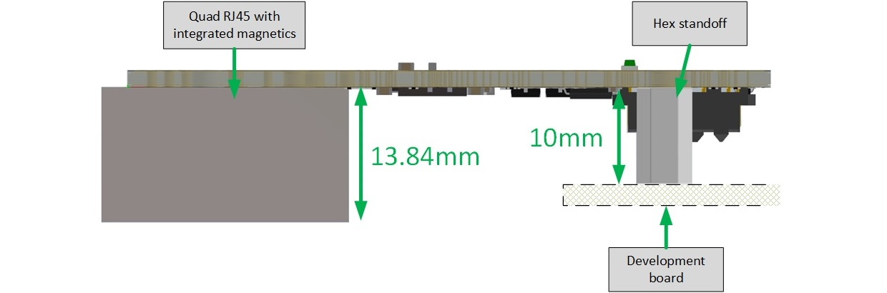
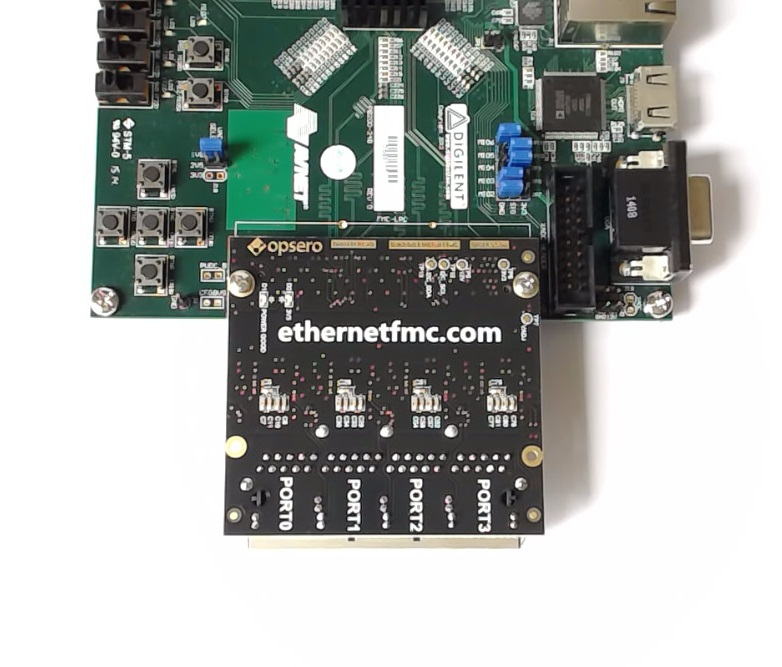
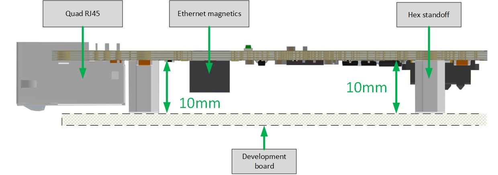
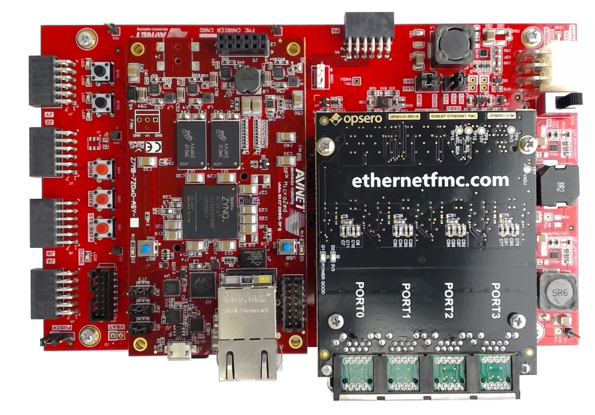
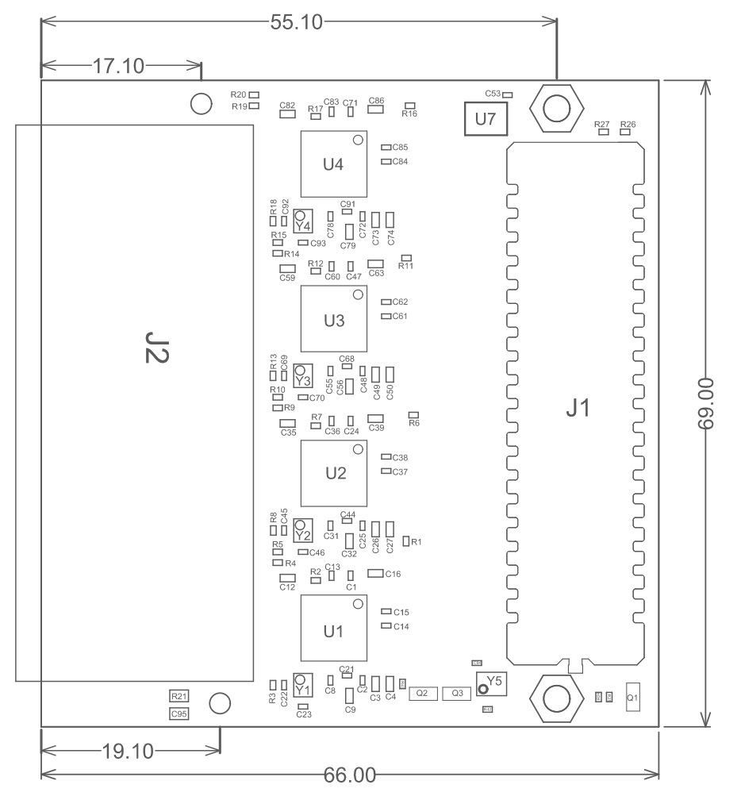
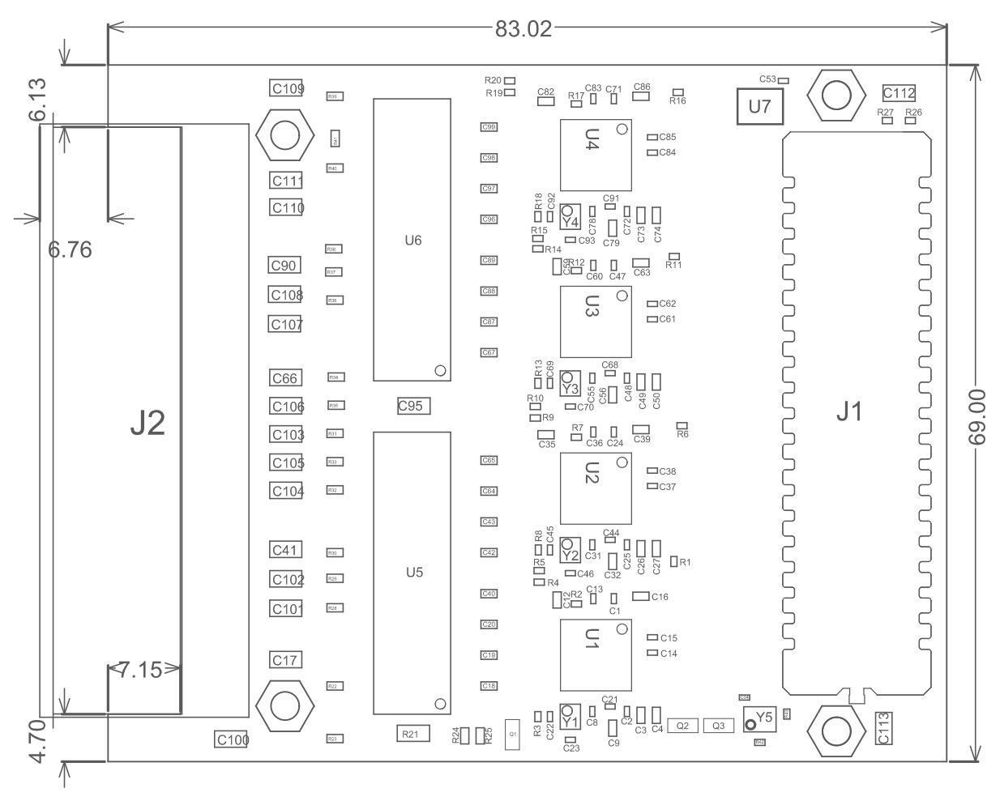

.. _mec-info:

======================
Mechanical Information
======================

.. _height-profile:

Height Profile
==============

The height profile of the Ethernet FMC and Robust Ethernet FMC is the critical difference
between the two models.

Ethernet FMC
------------
The figure below illustrates the height profile of the Ethernet FMC. Note that the quad
RJ45 connector with integrated magnetics has a maximum height of 13.84mm; this limits 
the Ethernet FMC for mating **only** with FMC connectors that are located close to the 
edge of the carrier board. In other words, the Ethernet FMC must be able to extend over 
the edge of the carrier board to allow for clearance of the RJ45 connector. All of the 
Xilinx development boards provide this level of clearance and are designed with the FMC 
connectors in close proximity to the edge of the board.

    
    Ethernet FMC height profile (view from side)

The figure below displays an example of a carrier board with an FMC connector that is
located in close proximity to the board edge. The Ethernet FMC is limited to mating
with this type of carrier board only.

    
    Example carrier board with FMC connector close to the board edge (ZedBoard).
    Note that the Ethernet FMC extends past the board edge of the carrier, so there
    is plenty of clearance for the RJ45 connector.

Robust Ethernet FMC
-------------------
The figure below illustrates the height profile of the Robust Ethernet FMC. All of the
components on the Robust Ethernet FMC fit within the 10mm gap between the FMC card and
the development board. It was designed this way to allow it to mate with all FMC carrier
boards, including those that provide a dedicated area for fixing the FMC to the carrier
by means of the 4 hex standoffs.

    
    Robust Ethernet FMC height profile (view from side)

The figure below displays an example of a carrier board with a dedicated area for fixing
the FMC. In this case, the FMC connector is **not** located close to the board edge and
the FMC must have a height profile that fits within the 10mm gap. The Robust Ethernet 
FMC was designed for this type of carrier, but is not limited to this type.

    
    Example carrier board with dedicated area for fixing the FMC by means of 4 hex
    standoffs (MicroZed FMC Carrier)

Dimensions
==========

The mechanical dimensions of the Ethernet FMC and Robust Ethernet FMC are illustrated
in the figures below. All dimensions are in millimeters (mm).

The assembly drawings are also available as PDF files that you can download at the provided links.

Ethernet FMC
------------

    
    Ethernet FMC mechanical drawing

* `Ethernet FMC Rev-D Assembly Drawing <http://ethernetfmc.com/downloads/EthFMC_ASSM_RevD.PDF>`_
* `Ethernet FMC Rev-E Assembly Drawing <http://ethernetfmc.com/downloads/EthFMC_ASSM_RevE.PDF>`_
* `Ethernet FMC Rev-F Assembly Drawing <http://ethernetfmc.com/downloads/EthFMC_ASSM_RevF.PDF>`_

Robust Ethernet FMC
-------------------

    
    Robust Ethernet FMC mechanical drawing

* `Robust Ethernet FMC Rev-C Assembly Drawing <http://ethernetfmc.com/downloads/RobustEthFMC_ASSM_RevC.PDF>`_
* `Robust Ethernet FMC Rev-D Assembly Drawing <http://ethernetfmc.com/downloads/RobustEthFMC_ASSM_RevD.PDF>`_

3D Model
========

The 3D model of the board is available as a STEP file at the links below:

Ethernet FMC
------------

* `Ethernet FMC Rev-D 3D STEP model <http://ethernetfmc.com/downloads/EthernetFMC_RevD_3D.zip>`_
* `Ethernet FMC Rev-E 3D STEP model <http://ethernetfmc.com/downloads/EthernetFMC_RevE_3D.zip>`_
* `Ethernet FMC Rev-F 3D STEP model <http://ethernetfmc.com/downloads/EthernetFMC_RevF_3D.zip>`_

Robust Ethernet FMC
-------------------

* `Robust Ethernet FMC Rev-C 3D STEP model <http://ethernetfmc.com/downloads/RobustEthernetFMC_RevC_3D.zip>`_
* `Robust Ethernet FMC Rev-D 3D STEP model <http://ethernetfmc.com/downloads/RobustEthernetFMC_RevD_3D.zip>`_

