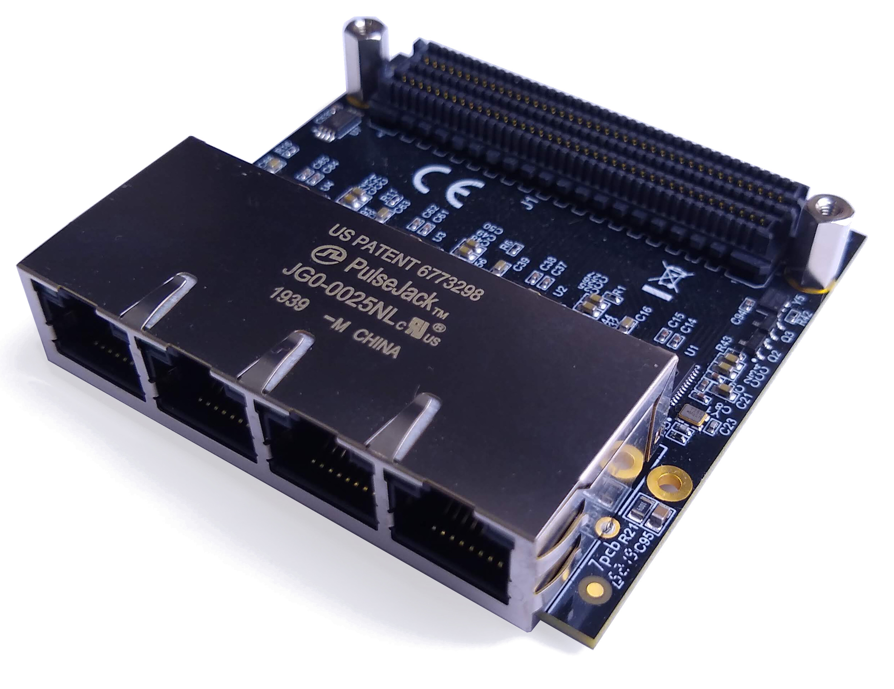
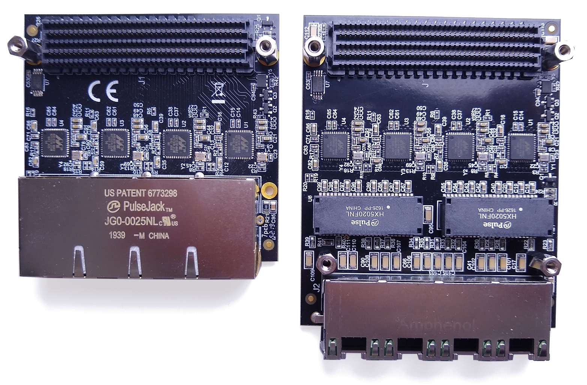

Overview
========

Description
-----------

The Ethernet FMC (FPGA Mezzanine Card) is an add-on/expansion board for FPGA and SoC based development boards.
The mezzanine card has 4x Marvell 88E151x Gigabit Ethernet PHYs to provide 4 ports of gigabit Ethernet 
connectivity to the carrier development board.

    
    Ethernet FMC

Features
--------

* 4x Marvell `88E151x <https://www.marvell.com/content/dam/marvell/en/public-collateral/transceivers/marvell-phys-transceivers-alaska-88e151x-datasheet-2018-02.pdf>`_ Gigabit Ethernet PHYs
* RGMII PHY interface
* Quad Ethernet RJ45 with magnetics
* FMC pinout conforms to Vita 57.1 FMC Standard
* Example designs with sources for several development boards
* Standalone and PetaLinux example designs

Variations
----------

To enable support for the majority of FPGA/SoC development boards on the market, the Ethernet FMC is available 
in two models and two voltage specifications.

    
    Ethernet FMC (left) vs Robust Ethernet FMC (right)

The image above illustrates the differences between the Ethernet FMC and Robust 
Ethernet FMC. They are two physically different boards, however they use the same
pinout on the FMC connector, allowing them to be used interchangably with the same
software running on the carrier board.
The main difference between the boards is that the Robust Ethernet FMC
uses Ethernet magnetics that are external to the RJ45 connector. This allows the
Robust Ethernet FMC to have a height profile that is physically compatible with 
more carrier boards than the Ethernet FMC. For more detail, see :ref:`mec-info`.

Both the Ethernet FMC and the Robust Ethernet FMC are available in two different
voltage ratings: 1.8VDC and 2.5VDC.

The table below lists the 4 variations and their part numbers.

+--------------------------+-----------------------+-------------------------+
| Part name                | Voltage rating (VADJ) | Part number             |
+==========================+=======================+=========================+
| Ethernet FMC 1.8V        | 1.8VDC                | OP031-1V8               |
+--------------------------+-----------------------+-------------------------+
| Ethernet FMC 2.5V        | 2.5VDC                | OP031-2V5               |
+--------------------------+-----------------------+-------------------------+
| Robust Ethernet FMC 1.8V | 1.8VDC                | OP041-1V8               |
+--------------------------+-----------------------+-------------------------+
| Robust Ethernet FMC 2.5V | 2.5VDC                | OP041-2V5               |
+--------------------------+-----------------------+-------------------------+

To determine which Ethernet FMC is compatible with your development board, please
refer to the list of :ref:`compatible-boards` in the User Guide.

